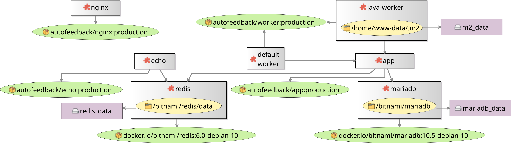

# Containers to MiniYAML

This example transformation takes a diagram of a [Docker Compose](https://docs.docker.com/compose/) composition, and produces a [Docker Compose YAML](https://docs.docker.com/compose/compose-file/) file from it.

The diagrams are implemented using [Eclipse Sirius](https://www.eclipse.org/sirius/).
For instance, this one is based on [AutoFeedback](https://gitlab.com/autofeedback/autofeedback-webapp/-/blob/master/docker-compose.yml), a web application with a MariaDB database, a Redis event store with Laravel Echo push notifications, two types of background workers, an `nginx` HTTP server for static files, and a PHP application server:

The aim of the transformation is to work in a bidirectional way, being able to update an existing YAML while keeping the parts that are outside the control of the diagrams, and also update the diagrams from the YAML files.

## Case structure

* [`BenchmarxContainersToMiniYAML`](BenchmarxContainersToMiniYAML): test suites and scalability measurement tool for this case.
* [`case-paper`](case-paper): LaTeX sources for the [Transformation Tool Contest](https://www.transformation-tool-contest.eu/) case paper.
* [`implementationArtefacts`](implementationArtefacts): one folder per solution for this case. The reference implementation is the `epsilon` one (more details [below](#reference-implementation)).
* [`metamodels`](metamodels): implementations of the concepts in the Containers and MiniYAML modeling languages using the [Eclipse Modeling Framework](https://www.eclipse.org/modeling/emf/).
* [`target-platform`](target-platform): Eclipse target platform for building the Eclipse-based artifacts of this case. The `.target` file is generated from the `.tpd` file, written in the [Target Platform DSL](https://github.com/eclipse-cbi/targetplatform-dsl).
* [`workbench`](workbench): plugins to be used from a nested Eclipse workbench, if you want to use the Sirius-based editor and run the reference implementation of the transformation from the Eclipse UI as a regular user.
* [`projectSet.psf`](projectSet.psf): Team Project Set to import when working on this case.

## Setting up the development environment

Download and set up a modern version of the [Eclipse Modeling Tools](https://www.eclipse.org/downloads/packages/) for your operating system.

Launch Eclipse, and select `File - Import... - Team - Team Project Set`.
Point the import to the raw URL of `projectSet.psf`:

https://raw.githubusercontent.com/agarciadom/benchmarx/main/examples/containerstominiyaml/projectSet.psf

Eclipse will clone this Git repository, import the appropriate projects, and set up the working sets.

Open the `.target` file in the `uk.ac.york.ttc.containers.targetplatform` project.
Wait for it to fully resolve, and then click on the "Set as Target Platform" on the top right.

## Reference implementation

The reference implementation is written using several languages of the [Eclipse Epsilon](https://www.eclipse.org/epsilon/) project:

* A one-way [ETL](https://www.eclipse.org/epsilon/doc/etl/) script transform Containers models to MiniYAML models.
* Another one-way ETL script transforms MiniYAML models to Containers models.
* An [EML](https://www.eclipse.org/epsilon/doc/eml/) script merges two MiniYAML models together, where the "left" one defines the available set of containers, images, volumes and other aspects explicitly modelled in the Containers metamodel. Any other YAML elements are combined across left and right sides.
* A small Java program to convert between MiniYAML models and YAML files, using [SnakeYAML](https://bitbucket.org/snakeyaml/snakeyaml/wiki/Documentation).

To try out the Sirius diagram editor and the transformation, right-click on the `Run ContainersToMiniYAML Workbench.launch` file in the `BenchmarxContainersToMiniYAML` project and select "Run As - Eclipse Application".

This will launch a nested Eclipse workbench. From this nested workbench, import the projects in the `workbench` folder.

To edit the example model, open the diagram inside the `representations.aird` file in the `uk.ac.york.ttc.containers.model`.

To transform a `.containers` file into YAML, right-click on the file in the "Project Explorer" or "Package Explorer" views and select "Generate Compose YAML". If a `.yaml` file with the same name already exists, it will be backed up with an `.old` suffix, and the newly generated YAML file will be merged with it using EML.

To transform a `.yaml` file into a Containers model, right-click on the file and select "Generate Containers Model". The old Containers model will be overwritten.

## Adding your own implementation

If you want to solve this case with your transformation tool, note that it does not need to be written in Java, but you must provide a way to launch it from Java.

### Java launcher

To integrate your solution, add any implementation artifacts into a subfolder of `implementationArtefacts` named after your tool: if you add a new Eclipse project, update `projectSet.psf` through `File - Export - Team - Team Project Set`.
Extend the `BenchmarxContainersToMiniYAML` project to refer to your tool:

* Add a new Java package under `org.benchmarx.examples.containerstominiyaml.implementations` named after your tool, and add a Java class implementing the `BXToolForEMF<Composition, miniyaml.Map, Decisions>` interface for launching your tool.
  * If your tool is EMF-based, you can use `EpsilonContainersToMiniYAML` as a base.
  * If it is not EMF-based, you can look at the [Families2Persons BiGUL implementation](../familiestopersons/BenchmarxFamiliesToPersons/src/org/benchmarx/examples/familiestopersons/implementations/bigul/BiGULFamiliesToPersons.java) (but it will need adaptation to this different transformation).
* Extend the list of tools in the `tools()` method in the `ContainersToMiniYAMLTestCase` class, to refer to your new Java class. You will need to add it twice: once with the `MiniYAMLComparator` (which ignores key/list item order), and once with the `MiniYAMLExactComparator` (which requires an exact order match).
* Extend the `TOOLS` list in the `ScalabilityMeasurements` class to refer to your tool as well.

### External dependencies

If you need any additional libraries and they are available from an Eclipse update site, ideally add them to the target platform by modifying the `.tpd` file and generating the new version of the `.target` file from it.
If they are not available from an Eclipse update site, add the JARs to the classpath of the `BenchmarxContainersToMiniYAML` project.

In addition, if your tool requires additional setup beyond compiling an Eclipse project, please document these steps in a `README-SETUP` file under your `implementationArtefacts` subfolder.

### Evaluating correctness

The test cases are written in [JUnit 4](https://junit.org/junit4/), following the Benchmarx framework as described in this [TTC 2017 case](https://www.transformation-tool-contest.eu/2017/solutions_familiesToPersons.html) and its [follow-up SoSyM paper](https://link.springer.com/article/10.1007/s10270-019-00752-x).
Currently, there are three test suites:

* `BatchForward`: tests for the Containers-to-MiniYAML transformation in the batch case (no previous MiniYAML model exists, and the transformation only runs once).
* `BatchBackward`: tests for the opposite direction (MiniYAML-to-Containers), also in the batch case.
* `IncrementalForward`: tests for the Containers-to-MiniYAML transformation where there is already an existing MiniYAML model, and the Containers model undergoes a certain change.

Feel free to send pull requests improving and extending the tests, to highlight the strengths of your tool and weaknesses of other tools.

### Measuring conciseness

In order to measure the conciseness of your implementation, every solution should come with a script to automatically count the number of words used to implement the transformations (ignoring the launcher class in `BenchmarxContainersToMiniYAML`, which is assumed to only set up the execution environment for the tool).
The script should ignore comments and whitespace.

If your language only uses C-style comments (`//` and `/* */`), you can adapt the [`count-words.sh`](implementationArtefacts/epsilon/uk.ac.york.ttc.containers.epsilon.tx/count-words.sh) script in the reference implementation.